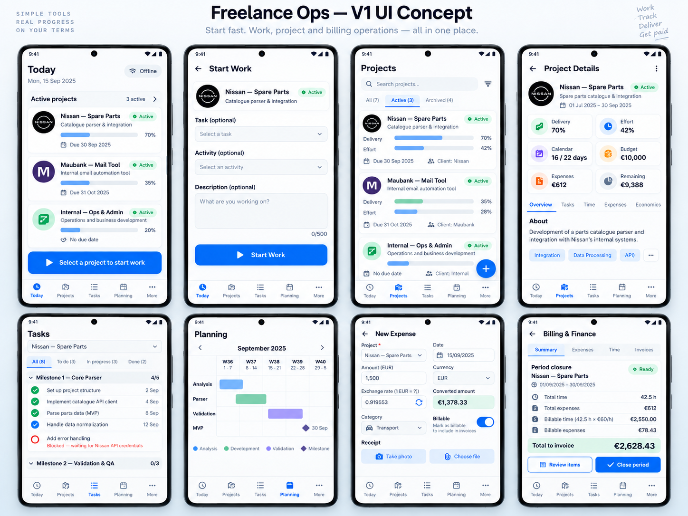

# Freelance Ops V1 — UI/UX Design

Date: 2026-09-16
Status: Approved
Branch: `docs/v1-design`

## 1. Product interaction principle

The UI must preserve this product principle:

> Freelance Ops must be simple enough to start tracking work in seconds, while remaining structured enough to answer later how much was worked, where time was spent, what it cost, how much can be billed, and whether a project is deviating from plan.

The application therefore separates **fast capture** from **structured enrichment**. A user must be able to start work with minimal input and add task, activity, notes, expenses, estimates, milestones, and commercial structure without blocking the timer flow.

## 2. Today — primary entry point

The first screen is not a passive dashboard and does not initially force the user through a separate project picker.

When no timer is active, `Today` shows **all active projects** directly.

Each active-project card should expose only enough information to support rapid selection:

- project name;
- client/context;
- active status;
- lightweight delivery/effort indicator where useful;
- due date when defined.

The primary interaction is:

```text
Open app
  -> select active project
  -> Start Work
```

Project is the only mandatory dimension to begin tracking. Task, activity, and description remain optional and can be selected immediately after project selection or enriched later.

When a timer is already running, the first screen switches priority to the active session and exposes PAUSE / RESUME / STOP without losing access to the rest of the app.

## 3. Start Work

After selecting a project, the Start Work screen keeps the chosen project fixed and offers:

- Task — optional;
- Activity — optional;
- Description — optional;
- prominent `Start Work` action.

The app should remember/re-rank recently used tasks and activities to minimize interaction cost without using AI in V1.

## 4. Main navigation

Approved primary navigation:

1. Today
2. Projects
3. Tasks
4. Planning
5. More

Finance, reporting, settings, export, backup, and related operations can be reached contextually or from `More` rather than competing with the daily tracking flow.

## 5. Projects

The Projects screen lists active, archived, and all projects with filters/search.

Project cards may show:

- status;
- delivery progress;
- effort consumption;
- due date;
- client.

The purpose is monitoring and management, not starting work as the only route. Starting work must remain possible from Today.

## 6. Project detail

Project detail consolidates:

- Delivery;
- Effort;
- Calendar position/deviation;
- Budget;
- Expenses;
- Remaining economic/effort capacity where meaningful.

Approved internal sections:

- Overview;
- Tasks;
- Time;
- Expenses;
- Economics.

## 7. Tasks

Tasks are shown by project and may be grouped by milestone.

The UI distinguishes:

- pending;
- in progress;
- completed;
- blocked (derived from incomplete dependencies).

Blocked tasks must explain the dependency that causes the block. The user may explicitly override the block when starting work.

## 8. Planning

V1 contains a simplified calendar/timeline/Gantt view.

It visualizes planned task ranges and milestones but does not introduce a complex drag-and-drop planning editor in V1. Dates are edited on the underlying task/project/milestone entities.

## 9. Expenses

The New Expense flow supports:

- project;
- date;
- original amount/currency;
- manual FX rate when needed;
- converted project-currency amount;
- category;
- reimbursable/billable classification;
- receipt/photo/file attachment.

The converted value is shown before save so the user can detect FX-entry errors.

## 10. Billing / finance

The finance flow provides billing-period closure preparation rather than formal fiscal invoicing.

A closure review shows at least:

- period;
- project/client context;
- total time;
- expenses;
- billable time amount;
- billable expense amount;
- total amount represented by the closure;
- review and close actions.

Closing creates the historical snapshot defined in the domain design.

## 11. Reports and export

V1 reports support filters by:

- period;
- client;
- project;
- activity;
- billable/non-billable.

Excel is a data-oriented export. PDF is a professional client-facing work report, not a fiscal invoice.

## 12. Error and empty-state behaviour

- Offline operation is normal and should not produce warning noise.
- Empty states explain the next useful action.
- STOP must never be blocked by optional metadata.
- Failed exports do not mutate source data.
- Missing attachments and restore-integrity problems are surfaced explicitly.
- Billing-closure and restore operations must not leave partial success states presented as valid.

## 13. Approved visual direction

- Android-first mobile layout.
- Professional productivity-app aesthetic.
- Clear card hierarchy.
- Restrained accent palette.
- Low-friction daily capture.
- Richer detail only when the user enters project-management or finance views.

The approved concept board is stored at:

`docs/assets/concepts/freelance-ops-v1-ui-concept.png`



For Phase 1 reconstruction, `docs/design/phase1-ui-contract.md` is the canonical visual/interaction contract and the PNG is the canonical visual reference. Functional/domain rules in the written specs remain authoritative for business semantics and data integrity; however, older written visual guidance must not be used to override the approved Phase 1 composition defined by the contract and PNG.
